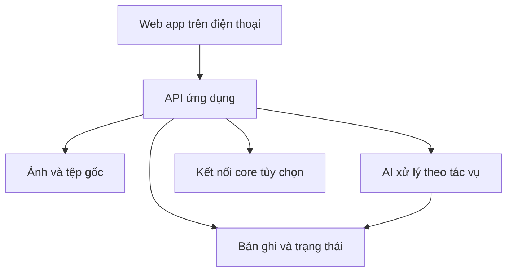

# Master plan — Ứng dụng AI và chuyển đổi số nhỏ gọn cho công việc hằng ngày

**Phiên bản:** 0.1 — 28/09/2026  
**Chủ sở hữu định hướng:** Nghĩa Nguyễn (Paul)  
**Trạng thái:** Tài liệu định hướng sản phẩm; các giả định cần xác nhận bằng thử nghiệm thực tế.

## 1. Tầm nhìn

Xây một danh mục ứng dụng đơn nhiệm, dùng tốt trên điện thoại, giúp nhân viên hoàn tất một thao tác công việc trong khoảng 30 giây đến 2 phút. Đầu vào là ảnh, mã QR, lời nói hoặc vài lựa chọn. Đầu ra là bản ghi có cấu trúc, việc cần xử lý hoặc báo cáo đã được người có trách nhiệm kiểm tra.

Mỗi ứng dụng có thể bán và vận hành độc lập. Một nền tảng kỹ thuật dùng chung chỉ phục vụ đăng nhập, biểu mẫu, tệp, lịch sử, AI, phân quyền và xuất dữ liệu. Tích hợp ERP/core là mô-đun tùy chọn theo nhu cầu của từng khách hàng, không phải điều kiện để bắt đầu.

**Lời hứa giá trị:** Bớt ghi chép lại, bớt tìm ảnh trong nhóm chat, bớt mất thời gian tổng hợp cuối ngày; vẫn truy được ai ghi nhận, lúc nào, ở đâu và dựa trên bằng chứng nào.

## 2. Nguyên tắc sản phẩm

1. Một app giải quyết một việc có người dùng, điểm bắt đầu và kết quả rõ ràng.
2. Màn hình đầu tiên đi thẳng vào thao tác chính; dữ liệu có sẵn thì chọn hoặc quét, hạn chế gõ.
3. AI soạn, trích xuất, nhóm và gợi ý; người dùng xác nhận các kết luận quan trọng. Không tự suy diễn tiến độ, số lượng hay mức tuân thủ chỉ từ ảnh thiếu góc nhìn.
4. Lưu bằng chứng gốc cùng bản AI tạo ra, bản đã sửa và lịch sử thay đổi.
5. Dùng được khi mạng yếu: có hàng đợi gửi lại cho các nghiệp vụ hiện trường; hiển thị trạng thái đồng bộ rõ ràng.
6. Dữ liệu chuẩn chỉ đồng bộ một chiều lúc đầu; ghi ngược vào ERP chỉ sau bước duyệt và thiết kế ánh xạ cụ thể.
7. Mỗi app phải có chỉ số chứng minh thời gian tiết kiệm hoặc chất lượng dữ liệu tăng lên trước khi mở rộng.

## 3. Danh mục cơ hội

| Mã | Ứng dụng | Người dùng | Thao tác chính | Kết quả tối thiểu | AI phù hợp | Core |
| --- | --- | --- | --- | --- | --- | --- |
| F01 | Nhật ký hiện trường | Giám sát, đội thi công | Chọn công trình/hạng mục, chụp ảnh, nói ghi chú | Nhật ký theo ngày, bản nháp báo cáo, việc vướng | Chuyển giọng nói, tóm tắt, đối chiếu lịch sử | Tùy chọn: dự án, hạng mục |
| F02 | Kiểm tra trưng bày | Sales, giám sát bán hàng | Chọn điểm bán, chụp kệ, tick checklist | Lần ghé, ảnh, điểm cần kiểm tra | Gợi ý vật thể/khoảng trống theo mẫu ảnh đã kiểm chứng | Tùy chọn: cửa hàng, SKU |
| F03 | Báo hỏng thiết bị | Vận hành, bảo trì, IT | Quét QR thiết bị, chụp ảnh, mô tả | Phiếu sự cố, người nhận, trạng thái, lịch sử | Phân loại triệu chứng, gợi ý kiểm tra | Tùy chọn: danh mục tài sản |
| F04 | Bàn giao ca | Kho, nhà máy, bảo vệ | Nói hoặc nhập việc xong, việc dở, bất thường | Biên bản bàn giao và xác nhận ca sau | Sắp xếp ý, rút đầu việc | Không bắt buộc |
| F05 | Kiểm đếm nhanh | Thủ kho | Quét mã, nhập số lượng, chụp vị trí | Danh sách chênh lệch cần rà soát | Nhận dạng mã/chữ khi cần | Tùy chọn: hàng, tồn, phiếu kiểm kê |
| F06 | Ghi nhận lỗi chất lượng | QC, sản xuất | Chọn lô/công đoạn, chụp lỗi | Phiếu lỗi, trạng thái xử lý, ảnh | Nhóm lỗi tương tự, hỗ trợ mô tả | Tùy chọn: lô, lệnh sản xuất |
| F07 | Theo dõi việc nhà thầu | Chủ đầu tư, quản lý tòa nhà | Chọn việc, chụp trước/sau, ghi nhận | Hồ sơ hoàn thành và điểm chưa đạt | Soạn biên bản dựa trên ghi chú | Tùy chọn: hợp đồng, công việc |
| F08 | Kiểm tra an toàn đầu ca | Tổ trưởng, HSE | Tick checklist, chụp bất thường | Danh sách nguy cơ, người xử lý, hạn | Tóm tắt và phân loại sơ bộ | Không bắt buộc |
| F09 | Đọc chứng từ đầu vào | Kế toán, mua hàng, kho | Chụp hoặc tải chứng từ | Trường dữ liệu và dòng hàng chờ kiểm tra | OCR, trích xuất theo mẫu | Tùy chọn: nhà cung cấp, PO, GRPO |
| F10 | Biên bản họp và đầu việc | Quản lý, nhóm dự án | Ghi âm hoặc gõ ý chính | Quyết định, đầu việc, người nhận, hạn | Chuyển lời nói, tóm tắt | Tùy chọn: task/calendar |

**Quy tắc chọn cơ hội:** Ưu tiên việc diễn ra thường xuyên, đang ghi qua giấy/chat/Excel, có đầu vào rõ, đầu ra kiểm chứng được và người dùng hiện trường sẵn sàng thử.

## 4. Ba sản phẩm đầu tiên

### F01 — Nhật ký hiện trường

**Tình huống:** Cuối ngày giám sát phải lục ảnh và tin nhắn để viết báo cáo; thiếu ngữ cảnh về công trình, hạng mục, thời điểm và việc tồn.

**Luồng MVP:** Mở app → chọn công trình và hạng mục → chụp 1–5 ảnh → nói hoặc nhập ghi chú → xem bản nháp → sửa và gửi → người quản lý nhận bản tổng hợp theo ngày.

**Dữ liệu tối thiểu:** mã công trình, hạng mục, người ghi, thời điểm, ảnh gốc, mô tả, trạng thái công việc, vướng mắc, người theo dõi, phiên bản báo cáo. GPS là tùy chọn và phải hiển thị cho người dùng khi thu thập.

**Đầu ra:** nhật ký có thể lọc theo công trình/ngày; báo cáo ngày gồm việc đã ghi nhận, bằng chứng, việc chờ xử lý. AI chỉ tổng hợp từ các bản ghi có nguồn; chỗ chưa rõ ghi “cần xác nhận”. Không tự tính tỷ lệ hoàn thành từ ảnh.

**Ngoài MVP:** tiến độ Gantt, đo khối lượng tự động, nhận dạng lỗi xây dựng chuyên sâu, tự phát hành biên bản nghiệm thu.

### F03 — Báo hỏng thiết bị qua QR

**Tình huống:** Người dùng báo sự cố qua chat nhưng thiếu mã máy và lịch sử, khó giao đúng người và khó biết đã sửa xong chưa.

**Luồng MVP:** Quét QR → xem tên/vị trí thiết bị → chụp ảnh và nói triệu chứng → gửi → nhân viên bảo trì nhận việc → cập nhật xử lý → người báo xác nhận hoàn tất.

**Dữ liệu tối thiểu:** mã thiết bị, vị trí, loại sự cố, mô tả, ảnh, người báo, người xử lý, mốc thời gian, trạng thái, kết quả sửa. AI phân loại để điều phối, không đưa hướng dẫn sửa chữa nguy hiểm hoặc thay quyết định chuyên môn.

**Đầu ra:** trang lịch sử theo thiết bị; phiếu sự cố và danh sách việc đang mở. Có thể khởi đầu bằng danh mục thiết bị tải từ CSV.

**Ngoài MVP:** dự đoán hỏng hóc, cảm biến IoT, quản lý vật tư bảo trì, lịch bảo dưỡng đầy đủ.

### F02 — Kiểm tra trưng bày cho Sales

**Tình huống:** Ảnh kệ gửi vào nhóm nhưng khó đối chiếu tiêu chuẩn và so sánh lần ghé trước.

**Luồng MVP:** Chọn điểm bán → chọn khu vực/quầy → chụp ảnh theo góc hướng dẫn → tick checklist ngắn → gửi → giám sát xem các điểm cần chỉnh và ảnh trước/sau.

**Dữ liệu tối thiểu:** điểm bán, nhân viên, thời điểm, khu vực, ảnh, checklist theo chương trình, nhận xét, việc cần xử lý. AI có thể gợi ý bất thường, nhưng chỉ chấm sản phẩm/SKU khi ảnh thực tế và bộ mẫu cho phép kiểm chứng; báo mức tin cậy và cho phép sửa.

**Đầu ra:** lịch sử lần ghé và tỷ lệ hoàn thành checklist do người dùng xác nhận. Không hứa tự đếm mọi SKU hay xác định thị phần kệ trong phiên bản đầu.

**Ngoài MVP:** định vị planogram chính xác, nhận diện toàn bộ SKU, phân tích đối thủ trên diện rộng.

## 5. Thứ tự ưu tiên và tiêu chí chọn pilot

Chấm mỗi ứng dụng 1–5 theo: tần suất thao tác (25%), thời gian tiết kiệm (20%), khả năng có khách hàng thử (20%), độ rõ của dữ liệu đầu vào (15%), độ dễ đo kết quả (10%) và chi phí/rủi ro triển khai thấp (10%). Điểm ban đầu dưới đây là **giả định định tính**, cần chấm lại sau phỏng vấn người dùng.

| Ưu tiên ban đầu | App | Vì sao | Rủi ro cần thử sớm |
| --- | --- | --- | --- |
| 1 | F01 Nhật ký hiện trường | Nỗi đau tổng hợp ảnh và báo cáo rất cụ thể; có thể chạy độc lập | Người dùng có chịu nhập hạng mục và sửa bản nháp không? |
| 2 | F03 Báo hỏng thiết bị | QR dẫn thẳng vào đúng hồ sơ; vòng đời sự cố rõ | Ai chịu trách nhiệm nhận và đóng phiếu? |
| 3 | F02 Kiểm tra trưng bày | Có lịch sử ảnh và checklist hữu ích dù AI chưa mạnh | Ảnh đủ sáng/góc; tiêu chuẩn trưng bày có rõ không? |
| 4 | F04 Bàn giao ca | Triển khai nhanh, dễ đo thời gian viết | Kỷ luật xác nhận của ca nhận |
| 5 | F09 Đọc chứng từ | Tiềm năng giảm nhập liệu | Đa dạng mẫu tiếng Việt, sai số dữ liệu kế toán |

**Đề xuất pilot đầu:** F01 tại một đội/công trình có người quản lý cam kết dùng báo cáo hằng ngày. Nếu không có đối tác hiện trường sẵn sàng, chuyển F03 cho một đội vận hành có danh mục thiết bị rõ. Chỉ nhận pilot F02 khi có checklist trưng bày và ảnh mẫu đủ đại diện.

## 6. Kiến trúc tối giản

**Các thành phần dùng chung:** tài khoản và vai trò; biểu mẫu theo app; quản lý ảnh/tệp; nhật ký sự kiện; tác vụ AI bất đồng bộ; màn hình duyệt; thông báo; xuất CSV/PDF; cấu hình khách hàng. Dùng chung code và hạ tầng, nhưng tách dữ liệu và cấu hình của từng tổ chức.

**Luồng AI:** lưu bản gốc → tiền xử lý/giảm kích thước phù hợp → trích xuất hoặc tóm tắt theo schema → kiểm tra trường bắt buộc → trả bản nháp kèm nguồn → người duyệt chỉnh sửa → ghi phiên bản cuối. Nếu AI lỗi hoặc quá hạn, người dùng vẫn lưu và hoàn tất bằng biểu mẫu thường.

**Dữ liệu cốt lõi gợi ý:** `organization`, `user`, `project_or_site`, `asset_or_item`, `record`, `attachment`, `task`, `ai_run`, `approval`, `audit_event`, `integration_job`. Đây là mô hình khái niệm; chỉ tạo bảng thật khi sản phẩm đầu cần.

**Tích hợp theo ba mức:**

| Mức | Cách làm | Khi dùng |
| --- | --- | --- |
| 0 | Danh mục nhập tay/CSV; xuất báo cáo/CSV | Pilot và khách hàng chưa có API |
| 1 | Đọc danh mục và mã chuẩn định kỳ từ core | Tránh nhập lại công trình, thiết bị, SKU, đối tác |
| 2 | Đẩy bản ghi đã duyệt về core qua API hoặc hàng đợi | Có nghiệp vụ tiếp nhận, ánh xạ và xử lý lỗi rõ |

Với SAP Business One hoặc Odoo, thiết kế adapter riêng theo hệ thống, phiên bản và quyền của khách hàng. Không ghi trực tiếp vào bảng giao dịch ERP. Cần khóa trùng, lưu mã tham chiếu hai chiều, log yêu cầu/đáp ứng và cơ chế thử lại có kiểm soát.

## 7. Ranh giới AI và kiểm soát chất lượng

- Prompt chỉ được dùng dữ liệu từ bản ghi, checklist và tài liệu được phép; không tự tạo số liệu, tên người, hạng mục hay kết luận nghiệm thu.
- Mỗi nhận định có thể truy về ảnh, ghi chú hoặc bản ghi nguồn; thông tin không chắc chắn được đánh dấu để người duyệt xem.
- Không dùng điểm tin cậy của mô hình như bằng chứng duy nhất để tự động phê duyệt.
- Tách dữ liệu cá nhân/khách hàng theo tổ chức; phân quyền ảnh và lịch sử; quy định thời hạn lưu và xóa theo hợp đồng pilot.
- Đo lỗi theo từng tác vụ: trường trích sai, bỏ sót việc, nhận dạng nhầm, bản tóm tắt thêm thông tin không có trong nguồn.
- Cần bộ dữ liệu thử có sự đồng ý của đơn vị pilot, gồm ảnh tốt/xấu, ngày bình thường/bất thường và tình huống mạng yếu.

## 8. Lộ trình thực hiện

| Giai đoạn | Thời lượng tham chiếu | Sản phẩm bàn giao | Điều kiện qua cổng |
| --- | --- | --- | --- |
| Khám phá | 1–2 tuần | 8–12 cuộc phỏng vấn; sơ đồ thao tác hiện tại; mẫu báo cáo/checklist; chọn 1 pilot | Có người chịu trách nhiệm, tình huống lặp lại và dữ liệu mẫu |
| Mẫu thao tác | 1 tuần | Prototype trên điện thoại; thử luồng với 3–5 người | Người dùng tự hoàn thành thao tác chính không cần hướng dẫn dài |
| MVP độc lập | 3–5 tuần | Đăng nhập, ghi nhận, ảnh, bản nháp AI, duyệt, lọc, xuất, log | Chạy trọn một quy trình thực tế; xử lý được khi AI lỗi |
| Pilot | 2–4 tuần | Vận hành ở phạm vi nhỏ; đo số liệu trước/sau; sửa lỗi | Người dùng sử dụng lặp lại; quản lý thực sự dùng đầu ra |
| Đóng gói | 2–3 tuần | Mẫu cấu hình, hướng dẫn triển khai, giá và hỗ trợ, bộ demo | Có thể dựng khách hàng thứ hai mà không sửa logic lõi |

Các mốc là ước lượng để lập kế hoạch, không phải cam kết tiến độ; thay đổi theo đội ngũ, yêu cầu bảo mật và dữ liệu pilot.

## 9. Thước đo và điều kiện dừng

**Trước pilot:** ghi thời gian hiện tại để tạo một bản ghi và báo cáo; tỷ lệ thiếu ảnh/ngữ cảnh; số lần phải hỏi lại; số người thực sự tham gia.

**Trong pilot:** thời gian hoàn thành thao tác; tỷ lệ bản ghi có đủ trường/ảnh; tỷ lệ AI cần sửa; thời gian người quản lý duyệt; số việc tồn được đóng; số người dùng hoạt động mỗi tuần; chi phí AI trên một bản ghi hữu ích.

**Cổng quyết định:** tiếp tục nếu quy trình tiết kiệm thời gian hoặc giảm lỗi có thể quan sát, người dùng quay lại dùng mà không bị nhắc liên tục, và người quản lý tin tưởng đầu ra sau khi duyệt. Điều chỉnh nếu phần lớn thời gian bị tiêu vào sửa AI hoặc nhập trường thừa. Dừng nếu không có người sở hữu quy trình hoặc dữ liệu đầu ra không được sử dụng.

## 10. Đóng gói thương mại

**Gói Pilot:** một quy trình, một tổ chức/đội, cấu hình mẫu, giới hạn người dùng và dung lượng, hỗ trợ đo hiệu quả. **Gói Standard:** nhiều đội/địa điểm, phân quyền, mẫu báo cáo, dashboard cơ bản. **Tùy chọn:** adapter ERP, quy trình duyệt riêng, nhận dạng ảnh chuyên biệt, SSO, chính sách lưu trữ theo khách hàng.

Định giá sau pilot theo giá trị và chi phí thực tế: phí thiết lập cấu hình + thuê bao theo đội/địa điểm hoặc số bản ghi, với hạn mức lưu trữ và AI minh bạch. Không định giá cứng khi chưa biết tần suất ảnh, âm thanh, yêu cầu bảo mật và mức hỗ trợ.

## 11. Backlog MVP chung

**P0:** đăng nhập; phân quyền tối thiểu; tạo bản ghi trong ba thao tác chính; tải ảnh; lưu nháp; hàng đợi khi mạng chập chờn; tác vụ AI có trạng thái; sửa bản nháp; duyệt; lịch sử; xuất dữ liệu; nhật ký lỗi.  
**P1:** QR; ghi âm/chuyển giọng nói; thông báo việc mới; mẫu báo cáo theo khách hàng; nhập danh mục CSV; tìm kiếm và lọc.  
**P2:** kết nối core; dashboard nâng cao; nhận dạng ảnh chuyên biệt; cấu hình biểu mẫu không cần lập trình; API cho đối tác.

Không xây tất cả P0 của mọi app cùng lúc. Chốt F01 trước, sau đó trích thành thành phần dùng chung khi F03 xuất hiện nhu cầu thực tế.

## 12. Các quyết định cần chốt trước khi code

1. Đội pilot đầu tiên là ai, quy trình hiện tại và báo cáo mẫu đang dùng là gì?
2. Một bản ghi đạt yêu cầu cần các trường nào; trường nào có thể bỏ qua khi đứng ở hiện trường?
3. Ai duyệt, ai nhận việc phát sinh, thời điểm nào báo cáo được coi là chính thức?
4. Ảnh và dữ liệu được lưu ở đâu, ai được xem, thời gian giữ bao lâu?
5. Có cần dùng khi mất mạng hoàn toàn hay chỉ cần chịu được kết nối chập chờn?
6. Có danh mục core/API sẵn không, hay nhập CSV là đủ cho đợt đầu?
7. Mẫu nào là thước đo chấp nhận AI: 20–50 bản ghi thật được người phụ trách đánh dấu lỗi và sửa?

## 13. Bước tiếp theo đề xuất

Chọn **F01 Nhật ký hiện trường** làm sản phẩm số 1. Thu 10–20 báo cáo và bộ ảnh đã được phép sử dụng từ một đội thực tế; quan sát một ngày làm việc; phác thảo 3 màn hình (ghi nhận, lịch sử, duyệt báo cáo); thử bằng dữ liệu thật trước khi xây AI tự động. Nếu không có đội hiện trường để thử ngay, dùng cùng phương pháp cho **F03 Báo hỏng thiết bị**.
